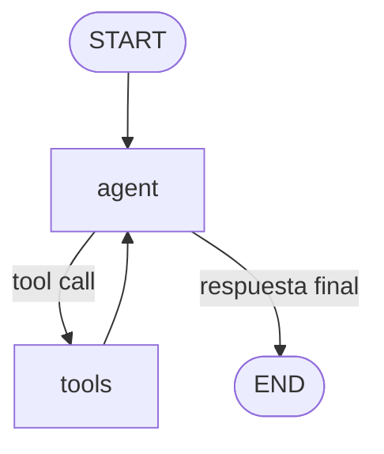

# Pre-entrega 5 — Agente autónomo con LangGraph (ReAct + memoria SQLite)

Agente que responde preguntas sobre clientes y sus pedidos, decidiendo **por
sí mismo** —vía tool calling— cuándo y con qué argumentos usar cada
herramienta. No hay ningún `if pregunta contiene "Ana"` en el código: el LLM
elige las herramientas leyendo únicamente sus docstrings.

## Caso de uso

Una base local (ficticia) de clientes y pedidos en JSON. El agente puede
resolver preguntas como:

> ¿Cuántos pedidos tuvo Ana Gómez y cuánto gastó en total?

sin conocer de antemano el `cliente_id` de Ana: tiene que buscarlo primero
por nombre, y recién después consultar sus pedidos. Ese encadenamiento de
dos herramientas —decidido por el modelo, no programado a mano— es el
punto central de esta entrega.

## Arquitectura



El ciclo `Tools -> Agent` es lo que permite razonamiento multi-paso: cada
vez que se ejecuta una herramienta, el resultado vuelve al LLM, que decide
si ya puede responder o si necesita otra herramienta más.

## Estructura de archivos

```text
pre_entrega_5/
├── config.py         # variables de entorno + validación
├── state.py          # alias de MessagesState (estado del grafo)
├── tools.py          # buscar_cliente_por_nombre / buscar_pedidos_cliente
├── agent.py          # nodo "agent", ToolNode, aristas y ciclo ReAct
├── persistence.py    # checkpointer de SQLite (memoria persistente)
├── trace.py          # arma la traza ReAct observable a partir de los mensajes
├── main.py           # demo: 3 preguntas, 2 threads
├── data/
│   ├── customers.json
│   ├── orders.json
│   └── checkpoints.sqlite   # se genera solo al ejecutar (no se commitea)
├── traces/
│   └── example_trace.json  # traza real de una ejecución (ver más abajo)
├── .env.example
├── requirements.txt
└── README.md
```

## Conceptos clave

### LangGraph vs. una cadena (LCEL)

Una **cadena** (como la de `pre_entrega_2` o `pre_entrega_3`, con LCEL y el
operador `|`) es una secuencia lineal de pasos: A -> B -> C, siempre en el
mismo orden, sin vuelta atrás. Un **grafo** (`StateGraph`) permite que el
flujo dependa de una decisión tomada en tiempo de ejecución y que existan
**ciclos**: acá el flujo va y vuelve entre `agent` y `tools` tantas veces
como el modelo lo necesite, algo que una cadena lineal no puede expresar.

### State y MessagesState

El `State` es la estructura de datos que viaja entre nodos del grafo y que
cada nodo puede leer y actualizar. `MessagesState` es un `State` que trae
LangGraph, con un único campo `messages: Annotated[list[AnyMessage],
add_messages]`. El `Annotated[..., add_messages]` es un **reducer**: le dice
a LangGraph que un mensaje nuevo devuelto por un nodo se **agrega** a la
lista existente, en vez de reemplazarla. Por eso ningún nodo de este
proyecto reescribe el historial a mano (ver `state.py`).

### Nodo, arista y arista condicional

Un **nodo** es una función (acá, `call_model` y `ToolNode`) que recibe el
`State` y devuelve una actualización parcial de él. Una **arista** conecta
dos nodos y define el orden fijo de ejecución (`tools -> agent`, siempre).
Una **arista condicional** (`add_conditional_edges`) en cambio elige el
siguiente nodo evaluando una función sobre el estado actual: acá,
`tools_condition` mira si el último mensaje del LLM trae `tool_calls` y
decide entre ir a `"tools"` o cortar a `END`.

### Tool Calling

Mecanismo por el cual un LLM, en vez de devolver solo texto, puede devolver
una estructura `{"name": ..., "args": {...}}` pidiendo que se ejecute una
función. El LLM **no ejecuta nada**: solo genera la intención. Quien
realmente llama a la función Python es `ToolNode`. Las tools se definen acá
con `@tool` (`langchain_core.tools`) y se "bindean" al modelo con
`llm.bind_tools(tools)` (ver `agent.py`), lo que le agrega al modelo las
descripciones necesarias para decidir.

### Por qué no hay `if/else` manual para elegir herramientas

Si el código dijera `if "Ana" in pregunta: buscar_cliente(...)`, el agente
dejaría de ser autónomo: cualquier pregunta con una redacción distinta
rompería la lógica. En cambio, acá el LLM lee las descripciones de
`buscar_cliente_por_nombre` y `buscar_pedidos_cliente` (ver los docstrings
en `tools.py`) y decide solo qué usar y con qué argumentos, para cualquier
forma de preguntar lo mismo.

### ToolNode y tools_condition

`ToolNode(tools)` es un nodo prearmado de LangGraph (`langgraph.prebuilt`):
toma el `tool_call` del último `AIMessage`, ejecuta la función Python real
correspondiente y agrega el resultado al estado como un `ToolMessage`.
`tools_condition` es la función de enrutamiento prearmada que se usa en la
arista condicional descripta arriba. Usar estas dos piezas prearmadas evita
escribir a mano el "parsing" de tool calls y el despacho por nombre de
función.

### Ciclo ReAct

**Re**ason + **Act**: el modelo razona sobre la pregunta y el historial
(reason), decide ejecutar una herramienta (act), observa el resultado
(observe) y vuelve a razonar con esa información nueva. Acá ese ciclo es
literalmente la vuelta `agent -> tools -> agent` del grafo, y puede repetirse
varias veces antes de la respuesta final. **No se le pide al modelo que
explique ese razonamiento interno**: la traza (`trace.py`) solo registra
eventos observables (qué tool se llamó, con qué argumentos, qué devolvió),
nunca el pensamiento privado del modelo.

### Checkpointer y SQLite

Un **checkpointer** es el componente de LangGraph que guarda el `State`
después de cada paso del grafo, asociado a un `thread_id`. Acá se usa
`AsyncSqliteSaver` (paquete `langgraph-checkpoint-sqlite`), que persiste ese
estado en un archivo SQLite (`data/checkpoints.sqlite`) en vez de guardarlo
solo en memoria. Gracias a esto, la conversación sobrevive aunque se cierre
y se vuelva a correr el programa.

> **Nota de versión:** en `langgraph-checkpoint-sqlite==3.1.1` (la versión
> instalada, verificada contra el entorno real de este repo) la única
> conexión soportada es la asíncrona: `AsyncSqliteSaver.from_conn_string(...)`
> vive en `langgraph.checkpoint.sqlite.aio` y se abre como context manager
> async (`async with ... as checkpointer:`). Como todo el proyecto corre con
> `await graph.ainvoke(...)` sobre `asyncio.run(main())`, se usa esta
> variante async y no la `SqliteSaver` síncrona (que también existe en el
> paquete, pero mezclaría una conexión bloqueante dentro de un event loop
> asíncrono).

### thread_id y memoria

El `thread_id` (pasado como `config={"configurable": {"thread_id": "..."}}`
en cada `ainvoke`) es la clave con la que el checkpointer guarda y recupera
el historial. Invocar al agente con el mismo `thread_id` continúa la misma
conversación; usar uno distinto arranca una conversación nueva, sin acceso
al historial de otros threads. `main.py` lo demuestra con dos threads
(`demo-user-1` y `demo-user-2`).

### recursion_limit

Tope máximo de "pasos" del grafo (vueltas `agent`/`tools`) para una misma
invocación (`graph.ainvoke(..., config={"recursion_limit": 10})`). Sin este
límite, un modelo que quedara pidiendo herramientas indefinidamente (por un
prompt mal diseñado, o un bug) podría generar un loop costoso en tokens y
tiempo. Acá se fija en `config.RECURSION_LIMIT = 10`.

### Manejo de resultados incompletos

Las herramientas (`tools.py`) **nunca lanzan una excepción** por no
encontrar datos: devuelven `{"encontrado": False, "mensaje": "..."}` (o,
para nombres ambiguos, una lista de `"coincidencias"`). Ese resultado se
agrega al historial como una observación más, y es el LLM quien decide qué
hacer: probar otra búsqueda, pedir una aclaración, o explicar que no hay
datos. El grafo no se cae en ningún caso porque no hay ninguna excepción sin
capturar en el camino feliz.

## Ejecución

Desde la raíz del repo:

```powershell
pip install -r requirements.txt
pip install -r pre_entrega_5\requirements.txt
copy pre_entrega_5\.env.example .env
```

(Si ya existe un `.env` con `OPENAI_API_KEY` de otra pre-entrega, no hace
falta tocarlo: esta entrega reutiliza esa misma variable. Sólo agregá
`MODEL_NAME` si querés usar un modelo distinto a `gpt-4o-mini`.)

```powershell
python -m pre_entrega_5.main
```

## Qué se observa en la demo

```text
=== PRE-ENTREGA 5: AGENTE LANGGRAPH ===

--- THREAD: demo-user-1 ---

Usuario: ¿Cuántos pedidos tuvo Ana Gómez y cuánto gastó en total?
[Herramientas utilizadas: buscar_cliente_por_nombre -> buscar_pedidos_cliente]
Respuesta: Ana Gómez tuvo 3 pedidos y gastó un total de 8800.
[Traza guardada en .../pre_entrega_5/traces/example_trace.json]

--- MISMO THREAD: demo-user-1 ---

Usuario: ¿Y cuál fue su último pedido?
[No hizo falta usar ninguna herramienta; respondio con la memoria del thread]
Respuesta: El último pedido de Ana Gómez fue el pedido ID 1003, realizado el 5 de septiembre de 2026, por un total de 3100.

--- THREAD NUEVO: demo-user-2 ---

Usuario: ¿Y cuál fue su último pedido?
[No hizo falta usar ninguna herramienta; respondio con la memoria del thread]
Respuesta: Necesito saber el nombre del cliente para poder buscar su último pedido. ¿Podrías proporcionarme el nombre completo o una parte del mismo?

--- THREAD NUEVO: demo-error ---

Usuario: ¿Cuántos pedidos tuvo Martina López y cuánto gastó en total?
[Herramientas utilizadas: buscar_cliente_por_nombre]
Respuesta: No se encontró ningún cliente con el nombre "Martina López". Por favor, verifica el nombre o proporciona más detalles.
```

Esta salida es real: se ejecutó contra la API de OpenAI en este entorno
(ver "Estado actual" más abajo), no está inventada. Se observa:

1. **Razonamiento multi-paso**: para la primera pregunta, el modelo encadena
   `buscar_cliente_por_nombre` (obtiene `cliente_id=102`) y después
   `buscar_pedidos_cliente(102)`, sin que el código le indique ese orden.
2. **Memoria dentro del mismo thread**: la segunda pregunta no repite "Ana
   Gómez", y el modelo responde igual, resolviendo la referencia con el
   historial persistido — y en este caso ni siquiera necesitó volver a
   llamar una herramienta, porque el total y el último pedido ya habían
   quedado en el historial de la primera respuesta.
3. **Aislamiento entre threads**: la misma pregunta en `demo-user-2` (thread
   nuevo, sin historial) no puede resolverse sola, y el modelo pide una
   aclaración en vez de inventar un cliente. Esto surge del contexto
   disponible, no de una respuesta hardcodeada.
4. **Resultado "no encontrado" sin romper el grafo**: "Martina López" no
   existe en `data/customers.json` a propósito. `buscar_cliente_por_nombre`
   devuelve `{"encontrado": false, "mensaje": "..."}` (sin lanzar ninguna
   excepción), ese resultado vuelve al nodo `agent` como una `ToolMessage`
   más, y es el LLM quien decide informar que no encontró al cliente en vez
   de inventar un `cliente_id`. No hay ningún manejo especial en el código
   para "Martina López": es el mismo camino `agent -> tools -> agent` que
   las otras tres pruebas, solo que la tool devuelve `encontrado: false`.

## Cómo interpretar la traza (`traces/example_trace.json`)

Es la traza real del primer intercambio (`demo-user-1`, primera pregunta),
generada por `trace.py` a partir de los mensajes de esa vuelta. Contiene
únicamente eventos observables, en orden:

```json
[
  {"type": "user", "content": "¿Cuántos pedidos tuvo Ana Gómez y cuánto gastó en total?"},
  {"type": "tool_call", "tool": "buscar_cliente_por_nombre", "args": {"nombre": "Ana Gómez"}},
  {"type": "tool_result", "tool": "buscar_cliente_por_nombre", "result": {"encontrado": true, "cliente_id": 102, "nombre": "Ana Gómez"}},
  {"type": "tool_call", "tool": "buscar_pedidos_cliente", "args": {"cliente_id": 102}},
  {"type": "tool_result", "tool": "buscar_pedidos_cliente", "result": {"encontrado": true, "cliente_id": 102, "cantidad_pedidos": 3, "total_gastado": 8800, "...": "..."}},
  {"type": "assistant", "content": "Ana Gómez tuvo 3 pedidos y gastó un total de 8800."}
]
```

No contiene chain-of-thought (no se le pidió al modelo que lo revele) ni
API keys (los mensajes de LangChain nunca las incluyen). Sirve para mostrar
el ciclo `Agent -> Tool -> Agent -> Tool -> Agent` de forma legible, sin
tener que leer logs crudos.

## Variables de entorno

| Variable | Obligatoria | Descripción |
| --- | --- | --- |
| `OPENAI_API_KEY` | Sí | La misma que ya usan `pre_entrega_1` / `pre_entrega_3` / `pre_entrega_4`. |
| `MODEL_NAME` | No (default `gpt-4o-mini`) | Modelo de chat de OpenAI con soporte de tool calling. |

`config.py` no valida al importarse (mismo criterio que `pre_entrega_4`): la
validación es explícita, vía `config.validar_configuracion()`, llamada al
principio de `main.py`.

## Notas sobre versiones (verificadas contra el entorno real, no copiadas de tutoriales)

- `langgraph==1.2.11`: `StateGraph`, `MessagesState`, `START`/`END` en
  `langgraph.graph`; `ToolNode`/`tools_condition` en `langgraph.prebuilt`.
- `langgraph-checkpoint-sqlite==3.1.1` (se agregó como dependencia nueva,
  no estaba instalada en el resto del repo): expone `AsyncSqliteSaver` en
  `langgraph.checkpoint.sqlite.aio`.
- `langchain-core==1.6.0`: el decorador `@tool` vive en
  `langchain_core.tools` (no en `langchain.tools`, que en versiones viejas
  de tutoriales es la ubicación típica pero acá es solo un re-export).
- `langchain-openai==1.6.0`: `ChatOpenAI.bind_tools(tools)` para tool
  calling.

## Estado actual

- **Probado contra la API real de OpenAI** en este entorno: los tres
  intercambios de `main.py` se ejecutaron de punta a punta (ver salida más
  arriba) y `traces/example_trace.json` es la traza de esa ejecución real,
  no un ejemplo inventado.
- Se verificó además, con un proceso Python separado (no solo dentro de la
  misma corrida de `main.py`), que el thread `demo-user-1` recupera su
  historial desde `data/checkpoints.sqlite` después de reiniciar el
  proceso — la persistencia sobrevive al cierre del programa, no es memoria
  en RAM.
- Las tools se probaron además de forma aislada (sin LLM), incluyendo los
  casos "cliente no encontrado" y "cliente sin pedidos".

## No incluido a propósito (fuera de alcance de esta entrega)

- FastAPI, Redis, Pinecone, ChromaDB, Docker.
- Múltiples agentes o un supervisor.
- Cualquier ruteo manual (`if/else`) para decidir qué herramienta usar.

El alcance de esta entrega es exclusivamente: LangGraph + State + Tool
Calling + ciclo ReAct + checkpointer de SQLite + `thread_id`.
