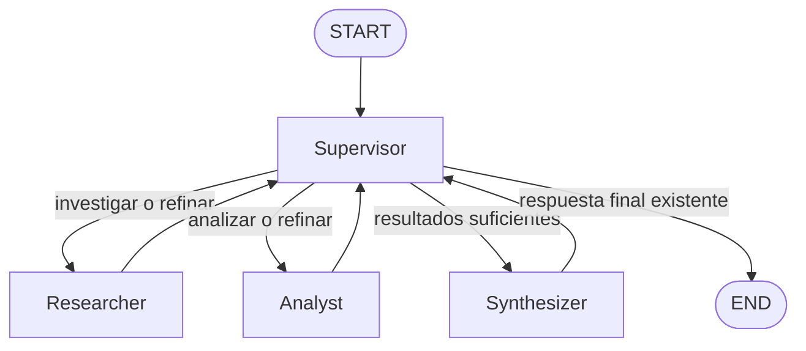

# Pre-entrega 6 — Orquestador multi-agente especializado

Prototipo funcional en **LangGraph** con topología jerárquica. Un nodo `Supervisor` valida el trabajo de dos agentes especialistas, decide dinámicamente el próximo paso y habilita una síntesis final solo cuando la investigación y el análisis son suficientes.

## Cumplimiento de la consigna

| Requisito | Implementación | Cómo verificarlo |
| --- | --- | --- |
| Topología jerárquica | `graph.py` | `START -> supervisor -> especialista -> supervisor` |
| Supervisor como router | `nodo_supervisor()` | Usa salida Pydantic estructurada con `Literal` y `add_conditional_edges` |
| Agente de investigación | `agents/research_agent.py` | ReAct + `simulated_research_search` |
| Agente de análisis/cómputo | `agents/analyst_agent.py` | ReAct + `estimate_automation_impact` + `validate_business_case` |
| Estado compartido estructurado | `state.py` | `OrchestratorState` hereda de `MessagesState` y guarda resultados, aportes y decisiones |
| Validación/refinamiento | `PROMPT_SUPERVISOR` en `graph.py` | El Supervisor evalúa resultados reales con una rúbrica y puede devolver la tarea al especialista |
| Evitar loop infinito | `MAX_STEPS` + `recursion_limit` | Hay un límite explícito de decisiones y una segunda protección de LangGraph |
| Síntesis final | `nodo_synthesizer()` | Integra investigación + análisis y resuelve conflictos |
| README + Mermaid | este archivo | Incluye topología, ejecución y explicación de conflictos |
| Demo | `video-curso.mp4` | Muestra la ejecución del flujo de punta a punta |

## Estructura

```text
pre_entrega_6/
├── agents/
│   ├── __init__.py
│   ├── research_agent.py
│   └── analyst_agent.py
├── state.py
├── graph.py
├── main.py
├── requirements.txt
├── .env.example
├── .gitignore
├── video-curso.mp4
└── README.md
```

## Topología elegida

La topología es **jerárquica**: los especialistas nunca se llaman entre sí. Todos vuelven al Supervisor, que concentra la decisión de ruteo y la validación.



### ¿Por qué esta topología?

Permite centralizar el control, hacer visible quién intervino y por qué, y evitar que los especialistas tomen decisiones globales. El Supervisor recibe únicamente la solicitud, los resultados de investigación/análisis y la información de control necesaria, evitando pasar metadata irrelevante a todos los agentes.

## Estado compartido

`OrchestratorState` hereda de `MessagesState` y agrega:

- `user_request`: solicitud original.
- `next_agent`: siguiente nodo elegido.
- `research_result`: último resultado del investigador.
- `analysis_result`: último resultado del analista.
- `final_answer`: síntesis final.
- `supervisor_feedback`: corrección concreta que debe considerar el siguiente especialista.
- `contributions`: historial de aportes por agente.
- `steps`: decisiones realizadas por el Supervisor.
- `task_completed`: indica si hubo una síntesis final válida.
- `validation_notes`: traza de validaciones y ruteo.

`contributions` y `validation_notes` usan reducers acumulativos para no perder información entre nodos.

## Supervisor y validación

El Supervisor usa `ChatOpenAI.with_structured_output(DecisionSupervisor)`. La salida contiene un `next_agent` limitado mediante:

```python
Literal["researcher", "analyst", "synthesizer", "FINISH"]
```

Además aplica esta rúbrica antes de cerrar:

1. La investigación debe tener hallazgos concretos y relevantes provenientes de la herramienta.
2. El análisis debe usar la investigación, incluir impacto operativo, cálculo numérico y una conclusión explícita.
3. Si algún resultado es insuficiente, el Supervisor devuelve el flujo al especialista correspondiente con feedback.
4. Solo se habilita `synthesizer` cuando existen investigación y análisis.
5. `FINISH` solo es válido cuando ya existe una respuesta final.

Esto permite cumplir el requisito de **validación/refinamiento** y evita que la supervisión se reduzca a comprobar simplemente si un campo existe.

## Especialistas y herramientas

### Researcher

`agents/research_agent.py` implementa un agente ReAct con `simulated_research_search`. La consigna permite una búsqueda externa como Tavily **o una búsqueda simulada**; en este prototipo se eligió una base local para que la demo no dependa de otra API.

### Analyst

`agents/analyst_agent.py` implementa otro agente ReAct con dos tools:

- `estimate_automation_impact`: estima horas ahorradas e impacto operativo.
- `validate_business_case`: realiza un cálculo simple de ahorro/costo y devuelve `conviene`, `conviene con reservas` o `no conviene`.

## Manejo de conflictos

El `synthesizer` no concatena ciegamente las respuestas. Si investigación y análisis entran en conflicto, su prompt indica priorizar la evidencia cuantitativa y operativa del analista y explicar brevemente la contradicción. No puede inventar datos nuevos.

## Protección contra loops

Hay dos niveles:

1. `MAX_STEPS = 6` limita las decisiones del Supervisor. Esto permite un refinamiento sin dejar un ciclo infinito.
2. `recursion_limit=25` en `main.py` agrega una protección adicional de LangGraph.

Si se alcanza `MAX_STEPS` y existen ambos insumos, se fuerza una síntesis con la mejor evidencia disponible. Si faltan insumos, el flujo termina como incompleto en lugar de declarar falsamente que la tarea se completó.

## Requisitos

- Python **3.12 o superior**.
- Una API key válida de OpenAI.

## Instalación desde un clone limpio

Desde la carpeta `pre_entrega_6`:

### PowerShell / Windows

```powershell
python -m venv .venv
Set-ExecutionPolicy -Scope Process -ExecutionPolicy RemoteSigned
.\.venv\Scripts\Activate.ps1
pip install -r requirements.txt
Copy-Item .env.example .env
```

Luego editar `.env` y completar:

```env
OPENAI_API_KEY=tu_api_key_real
MODEL_NAME=gpt-4o-mini
```

> `.env` está excluido por `.gitignore`. Nunca se deben subir claves reales al repositorio ni mostrarlas en videos/capturas.

## Ejecución

Consulta demo incluida:

```powershell
python main.py
```

También se puede probar otra consulta sin modificar el código:

```powershell
python main.py --query "Investigá oportunidades de IA para una inmobiliaria, analizá el impacto y recomendá si conviene implementarlas"
```

La salida muestra:

- resultado del Researcher;
- resultado del Analyst;
- síntesis final;
- agentes que contribuyeron;
- decisiones y validaciones del Supervisor;
- estado final y cantidad de pasos.

## Flujo esperado de la demo

```text
START
  -> supervisor
  -> researcher
  -> supervisor (valida investigación)
  -> analyst
  -> supervisor (valida análisis)
  -> synthesizer
  -> supervisor
  -> END
```

Si el Supervisor considera insuficiente una salida, puede ocurrir por ejemplo:

```text
researcher -> supervisor -> researcher -> supervisor
```

El segundo intento recibe el feedback concreto del Supervisor.

## Demo en video

`video-curso.mp4` muestra una ejecución del proyecto desde terminal y permite verificar el flujo de delegación. El video incluido en esta versión está recortado a la terminal para evitar exponer variables de entorno o secretos.

## Antes de entregar

1. Confirmar que todos los archivos de la estructura estén commiteados.
2. Confirmar que `.env` **no** esté en Git.
3. Ejecutar `python main.py` desde un entorno limpio.
4. Verificar que aparezcan Researcher, Analyst, Synthesizer y la traza del Supervisor.
5. Abrir `video-curso.mp4` y comprobar que no muestre claves.
6. Hacer un `git clone` limpio del repositorio público y repetir instalación + ejecución siguiendo únicamente este README.
