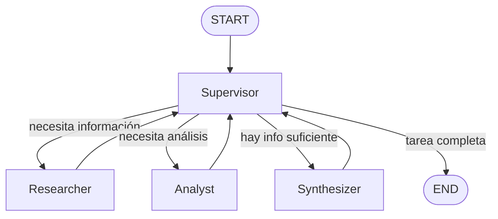

# Pre-entrega 6 — Orquestador multi-agente de análisis e investigación (LangGraph)

Prototipo de un orquestador **jerárquico** con LangGraph: un nodo
`Supervisor` coordina a dos agentes especialistas (`researcher` y
`analyst`) y a un nodo de cierre (`synthesizer`), para evaluar si conviene
implementar IA en un negocio a partir de una consulta en lenguaje natural.

## Qué hace el proyecto

`main.py` lanza una única consulta:

> Necesito evaluar si tiene sentido implementar un sistema con IA para un
> corralón. Quiero que investigues beneficios posibles, analices impacto
> operativo y cierres con una recomendación concreta.

El supervisor la va resolviendo en pasos, delegando en cada uno al agente
que corresponde, hasta producir una recomendación final concreta
("conviene" / "conviene con reservas" / "no conviene") y cerrar el flujo.

## Topología elegida: jerárquica, con supervisor como router

A diferencia de una topología en malla (donde cualquier agente podría
llamar a cualquier otro) o secuencial (un orden fijo, sin decisiones en
tiempo de ejecución), acá se eligió una topología **jerárquica**:

- El `Supervisor` es el único nodo que decide a dónde va el flujo.
- Los especialistas (`researcher`, `analyst`, `synthesizer`) **nunca se
  llaman entre sí** ni deciden el siguiente paso: siempre devuelven el
  control al `Supervisor`.
- Esto mantiene el control centralizado y auditable: en cualquier momento,
  la pregunta "¿por qué se ejecutó este agente ahora?" tiene una sola
  respuesta posible, la decisión del supervisor en ese paso (ver
  `validation_notes` en el estado).



## Qué hace cada agente

### Supervisor (`graph.py::nodo_supervisor`)

No es un agente ReAct: es un nodo que llama a un LLM con **structured
output** (`ChatOpenAI.with_structured_output(DecisionSupervisor)`), donde
`DecisionSupervisor` es un modelo Pydantic con un campo `next_agent:
Literal["researcher", "analyst", "synthesizer", "FINISH"]`. El LLM nunca
devuelve texto libre para el ruteo: devuelve directamente uno de esos
cuatro valores válidos, más una `razon` breve que queda registrada en
`validation_notes`. Esa decisión alimenta una arista condicional
(`add_conditional_edges`) que es la única forma de salir del nodo
`supervisor`.

### Researcher (`agents/research_agent.py`)

Agente ReAct (`create_react_agent`) con una sola tool,
`simulated_research_search`, que **simula** una búsqueda externa o una
consulta a una Vector DB: filtra una base de conocimiento fija embebida en
el archivo según palabras clave de la consulta, y devuelve resúmenes ya
redactados. No llama a Tavily ni a ningún servicio de red — la consigna de
esta entrega pide evitar esas dependencias externas. Su salida
(`research_result`) es un resumen en bullets de los beneficios posibles.

### Analyst (`agents/analyst_agent.py`)

Agente ReAct con dos tools de cómputo simple (sin llamadas externas):

- `estimate_automation_impact(area, volumen_operaciones)`: estima horas
  ahorradas por semana y nivel de impacto (bajo/medio/alto) de automatizar
  un área del negocio.
- `validate_business_case(costo_estimado_mensual, horas_ahorradas_semana, valor_hora)`:
  compara el ahorro mensual estimado contra el costo de la solución y
  devuelve una recomendación (`conviene` / `conviene con reservas` / `no
  conviene`).

Recibe como contexto la investigación previa (`research_result`) y produce
`analysis_result`.

### Synthesizer (`graph.py::nodo_synthesizer`)

No es un agente ReAct (no necesita tools): es un único llamado a
`ChatOpenAI` que integra `research_result` + `analysis_result` en una
recomendación final (`final_answer`), y marca `task_completed = True`.

## Estado compartido (`state.py`)

`OrchestratorState` extiende `MessagesState` (que ya trae `messages` con
su reducer `add_messages`) y agrega:

| Campo | Reducer | Quién lo escribe |
| --- | --- | --- |
| `user_request` | ninguno (reemplaza) | se fija una vez, en `main.py` |
| `next_agent` | ninguno (reemplaza) | `supervisor`, en cada decisión |
| `research_result` | ninguno (reemplaza) | `researcher` |
| `analysis_result` | ninguno (reemplaza) | `analyst` |
| `final_answer` | ninguno (reemplaza) | `synthesizer` |
| `contributions` | `operator.add` (acumula) | `researcher`, `analyst`, `synthesizer` |
| `steps` | ninguno (reemplaza) | `supervisor`, incrementado a mano |
| `task_completed` | ninguno (reemplaza) | `supervisor` / `synthesizer` |
| `validation_notes` | `operator.add` (acumula) | `supervisor` |

Los campos con reducer `operator.add` (`contributions`, `validation_notes`)
son listas: cada nodo devuelve solo **su** aporte nuevo (una lista de un
elemento) y LangGraph la concatena a lo acumulado, en vez de que cada nodo
tenga que leer y reescribir la lista completa. Los demás campos son
"último valor gana", que es lo correcto para un contador (`steps`) o para
un resultado que un solo nodo escribe una vez.

## Cómo se evitan los loops infinitos

Tres capas, de la más específica a la más general:

1. **Corte inmediato por resultado**: si `nodo_supervisor` ve que
   `final_answer` ya existe en el estado, devuelve `next_agent = "FINISH"`
   directo, sin ni siquiera llamar al LLM.
2. **`MAX_STEPS` (contador propio, = 6)**: cada vez que el supervisor toma
   una decisión (no cada vez que se ejecuta un nodo cualquiera), incrementa
   `steps`. Si `steps >= MAX_STEPS`, se fuerza `next_agent = "FINISH"` y
   `task_completed = True` sin importar lo que el LLM hubiera decidido,
   dejando una nota en `validation_notes`. El flujo feliz
   (`researcher -> analyst -> synthesizer -> FINISH`) usa solo 3
   decisiones, así que hay margen para que el supervisor repita algún paso
   si lo considera necesario, sin arriesgarse a un ciclo sin fin.
3. **`recursion_limit` de LangGraph** (fijado en `main.py`, no en
   `graph.py`): red de seguridad adicional a nivel de framework, que
   cuenta pasos de nodo (no decisiones del supervisor) y corta con una
   excepción si se excede. En condiciones normales nunca debería
   activarse, porque las capas 1 y 2 cortan antes.

## Cómo se manejan conflictos entre agentes

Puede pasar que `researcher` devuelva un panorama optimista (varios
beneficios posibles) mientras que `analyst` concluya que el caso de
negocio no cierra económicamente (o al revés). Ese conflicto no se
resuelve con lógica en Python: se le delega explícitamente al
`synthesizer` vía prompt — se le indica que, ante una contradicción entre
investigación y análisis, **priorice el análisis operativo/económico por
sobre el optimismo de la investigación** y lo aclare explícitamente en la
respuesta final, en vez de promediar ambos discursos sin comentario. Es la
misma idea de "validación" que pide la consigna: el sistema no solo
concatena las salidas de los agentes, sino que las contrasta antes de
darlas por buenas.

## Estructura de archivos

```text
pre_entrega_6/
├── agents/
│   ├── __init__.py
│   ├── research_agent.py   # simulated_research_search + create_react_agent
│   └── analyst_agent.py    # estimate_automation_impact / validate_business_case + create_react_agent
├── state.py                 # OrchestratorState (extiende MessagesState)
├── graph.py                 # supervisor, nodos, aristas condicionales, MAX_STEPS
├── main.py                  # demo end-to-end
├── requirements.txt
└── README.md
```

## Instalación y ejecución

Esta entrega reutiliza el `OPENAI_API_KEY` del `.env` de la **raíz** del
repo (el mismo que ya usan las pre-entregas anteriores). Si no existe,
crealo ahí con al menos:

```
OPENAI_API_KEY=tu_api_key_real
```

(Opcional: `MODEL_NAME` si querés usar un modelo distinto a
`gpt-4o-mini`.)

Después, desde esta carpeta:

```powershell
cd pre_entrega_6
pip install -r requirements.txt
python main.py
```

## Qué se observa en la demo

```text
=== PRE-ENTREGA 6: ORQUESTADOR MULTI-AGENTE (LANGGRAPH) ===

Solicitud original del usuario:
Necesito evaluar si tiene sentido implementar un sistema con IA para un corralón...

--- INTERVENCIÓN DEL AGENTE INVESTIGADOR ---
[resumen en bullets de beneficios posibles de IA para un corralón]

--- INTERVENCIÓN DEL AGENTE ANALISTA ---
[impacto operativo estimado + evaluación del caso de negocio]

--- SÍNTESIS FINAL ---
[recomendación final: conviene / conviene con reservas / no conviene]

--- CONTRIBUCIONES GUARDADAS POR CADA AGENTE ---
[1] Agente: researcher ...
[2] Agente: analyst ...
[3] Agente: synthesizer ...

--- TRAZA DE DECISIONES DEL SUPERVISOR ---
- Supervisor (decisión 1): ...
- Supervisor (decisión 2): ...
- Supervisor (decisión 3): ...

[Flujo terminado sin loop infinito: task_completed=True, decisiones del supervisor=3 (tope configurado: 6)]
```

Esta salida es real: se ejecutó contra la API de OpenAI en este entorno,
y el flujo terminó en 3 decisiones del supervisor (`researcher -> analyst
-> synthesizer -> FINISH`), muy por debajo del tope `MAX_STEPS = 6`.

## No incluido a propósito (fuera de alcance de esta entrega)

- Tavily, u otra API de búsqueda real: la investigación es simulada a
  propósito (`simulated_research_search`).
- Persistencia entre ejecuciones (checkpointer): esta entrega corre una
  sola consulta de punta a punta por ejecución, no maneja múltiples
  `thread_id` como `pre_entrega_5`.
- FastAPI, bases de datos vectoriales reales, Docker.
